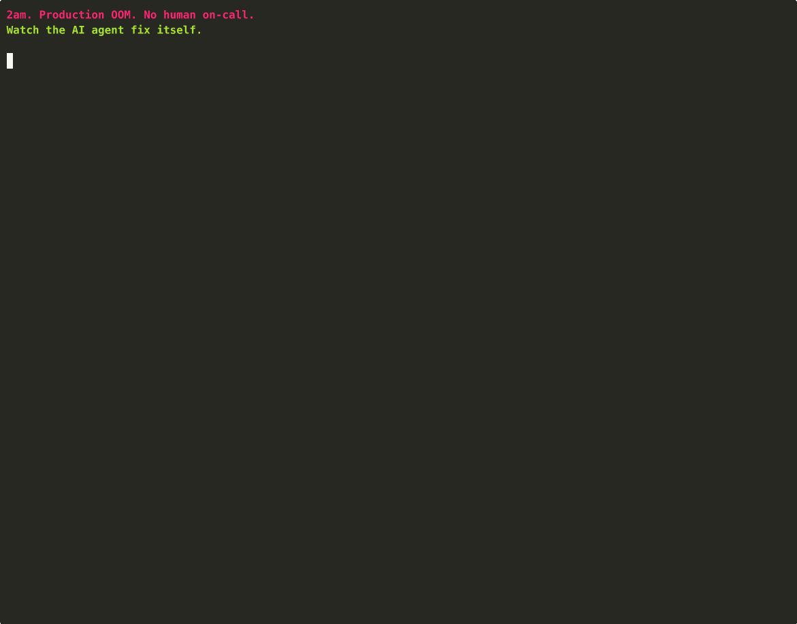
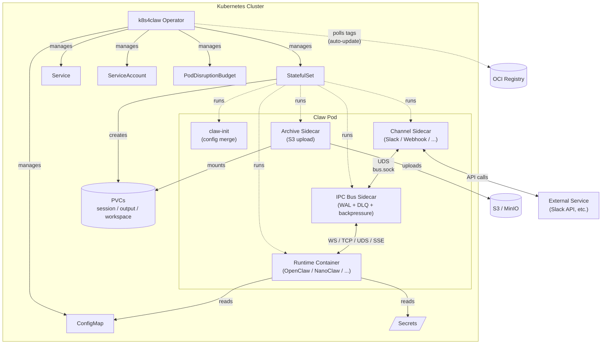

# k8s4claw

[](https://github.com/Prismer-AI/k8s4claw/actions/workflows/ci.yml)
[](https://github.com/Prismer-AI/k8s4claw/actions/workflows/codeql.yml)
[](https://goreportcard.com/report/github.com/Prismer-AI/k8s4claw)
[](https://github.com/Prismer-AI/k8s4claw/releases)
[](https://pkg.go.dev/github.com/Prismer-AI/k8s4claw)
[](LICENSE)
[](https://codespaces.new/Prismer-AI/k8s4claw?quickstart=1)

**A Kubernetes operator for AI agents that keeps the LLM out of the cluster's write path.** One CRD, any runtime (OpenClaw, NanoClaw, ZeroClaw, PicoClaw, IronClaw, HermesClaw), self-healing from day one.

## The core idea

k8s4claw keeps the LLM out of the cluster's write path. **The agent's ServiceAccount cannot patch workload objects.** The LLM can only submit a signed `ops-intent` on a Claw CR; a Go reconciler validates the intent against an allowlist (plus generation guard and Ed25519 signature) and is the only component that mutates workloads.

|                                  | LLMops tools with `kubectl` RBAC | **k8s4claw**                        |
| -------------------------------- | -------------------------------- | ----------------------------------- |
| Who mutates StatefulSets         | the LLM                          | the reconciler, never the LLM       |
| Blast radius if prompt-injected  | everything the SA can touch      | bounded by the intent allowlist     |
| Audit                            | kubectl audit logs               | Ed25519-signed receipts + K8s audit |

This is the main architectural distinction. Everything else (runtime registry, IPC bus, auto-update, archival) is infrastructure for running AI agents on K8s.

See [threat model](docs/security/threat-model.md) · [comparison](docs/marketing/comparison.md) · [claw4k8s design](docs/plans/2026-04-19-claw4k8s-design.md)

<p align="center">
  
  <br/>
  <em>Real OOM → ClawOpsController detects → rule matched → intent signed + consumed → Ed25519 audit trail. 90 seconds, end to end.</em>
</p>

## Why k8s4claw?

Running AI agents in production means solving the same problems over and over: secret management, persistent storage, graceful updates, inter-service communication, and observability. k8s4claw wraps all of this into a single `Claw` CRD so you can focus on what your agent does, not how it runs.

On top of that, **claw4k8s** lets agents self-heal without ever granting the LLM direct cluster-mutation rights. Deterministic rules auto-fix common issues (OOM → bump memory); novel issues escalate to a Companion Claw that proposes a fix, routes to human approval via Slack, and only then is the signed intent applied — still through the same reconciler, still bounded by the same allowlist.

## How is this different?

| Capability                         | k8sgpt          | kubectl-ai      | Holmes (Robusta) | k8s4claw + claw4k8s       |
| ---------------------------------- | --------------- | --------------- | ---------------- | ------------------------- |
| **LLM has `kubectl` / patch RBAC** | —               | human approves  | **yes**          | **no (by design)**        |
| Diagnoses cluster issues           | ✓               | ✓               | ✓                | ✓                         |
| Fixes without human approval       | —               | —               | —                | ✓ (rule-based)            |
| Fixes with human approval          | —               | ✓               | ✓                | ✓ (LLM escalation)        |
| **Agents manage their own infra**  | —               | —               | —                | **✓**                     |
| Cryptographic audit trail          | —               | —               | —                | ✓ (Ed25519)               |
| Graceful LLM fallback              | —               | —               | partial          | ✓ (notification)          |
| Primary target                     | diagnostic CLI  | kubectl wrapper | SRE incidents    | AI agent self-management  |

**The wedge:** claw4k8s is the first K8s operator where AI agents manage their **own** infrastructure, with the LLM kept out of the write path by RBAC rather than by a review step. Dogfooding as the product. See [full comparison](docs/marketing/comparison.md) and [threat model](docs/security/threat-model.md).

## Architecture



### IPC Bus Detail

The **IPC Bus** is a native sidecar that routes JSON messages between channel sidecars and the AI runtime:

```text
Channel Sidecar ──UDS──► IPC Bus ──Bridge──► Runtime Container
                        │  WAL  │
                        │  DLQ  │
                        │ Ring  │
                        │Buffer │
                        └───────┘
```

- **WAL** — append-only write-ahead log for at-least-once delivery
- **DLQ** — BoltDB dead letter queue for messages exceeding retry limits
- **Backpressure** — ring buffer with high/low watermark flow control
- **Bridge protocols** — WebSocket (OpenClaw), TCP (PicoClaw), UDS (NanoClaw), SSE (ZeroClaw)

## Supported Runtimes

The **Runtime** column shows the exact value to put in `spec.runtime` on a `Claw` CR. Names ending in `claw` are k8s4claw's internal runtime type enum — they are **wrappers around upstream projects**, not forks.

| `spec.runtime` | Language           | Upstream / Use Case                                                                                        | Gateway | Probe |
| -------------- | ------------------ | ---------------------------------------------------------------------------------------------------------- | ------- | ----- |
| `openclaw`     | TypeScript/Node.js | Full-featured AI assistant platform (first-party)                                                          | 18900   | HTTP  |
| `nanoclaw`     | TypeScript/Node.js | Lightweight secure personal assistant (first-party)                                                        | 19000   | TCP   |
| `zeroclaw`     | Rust               | High-performance agent runtime (first-party)                                                               | 3000    | HTTP  |
| `picoclaw`     | —                  | Ultra-minimal serverless agent (first-party)                                                               | 8080    | TCP   |
| `ironclaw`     | Rust + WASM        | Security/privacy-focused AI assistant (first-party)                                                        | 3001    | HTTP  |
| `hermesclaw`   | Python             | Runs [nousresearch/hermes-agent](https://github.com/nousresearch/hermes-agent) via a RuntimeAdapter        | 8642    | HTTP  |
| `k8sops`       | Go                 | Companion Claw runtime used by [claw4k8s](docs/plans/2026-04-19-claw4k8s-design.md) for self-healing       | 8800    | HTTP  |
| `custom`       | Any                | Bring your own runtime image                                                                               | —       | —     |

## Quick Start

### Prerequisites

- Kubernetes cluster (v1.28+, or [kind](https://kind.sigs.k8s.io/) / [minikube](https://minikube.sigs.k8s.io/) for local dev)
- kubectl configured
- Go 1.23+ (for building from source)

### 1. Install CRDs and run the operator

**Option A: Helm (recommended, v0.2.1+):**

```bash
helm install k8s4claw oci://ghcr.io/prismer-ai/charts/k8s4claw --version 0.2.1 \
  --namespace k8s4claw-system --create-namespace \
  --set webhook.certManager.enabled=true  # requires cert-manager pre-installed
```

Or from source:

```bash
git clone https://github.com/Prismer-AI/k8s4claw.git
cd k8s4claw
helm install k8s4claw charts/k8s4claw --namespace k8s4claw-system --create-namespace
```

**Option B: From source with Make:**

```bash
git clone https://github.com/Prismer-AI/k8s4claw.git
cd k8s4claw

# Install CRDs into the cluster
make install

# Run operator locally (or deploy with `make deploy`)
make run
```

### 2. Create a Secret for your LLM API keys

```bash
kubectl create secret generic llm-api-keys \
  --from-literal=ANTHROPIC_API_KEY=sk-ant-xxx \
  --from-literal=OPENAI_API_KEY=sk-xxx
```

### 3. Deploy your first AI agent

```yaml
# my-agent.yaml
apiVersion: claw.prismer.ai/v1alpha1
kind: Claw
metadata:
  name: my-agent
spec:
  runtime: openclaw
  config:
    model: "claude-sonnet-4"
  credentials:
    secretRef:
      name: llm-api-keys
  persistence:
    session:
      enabled: true
      size: 2Gi
      mountPath: /data/session
    workspace:
      enabled: true
      size: 10Gi
      mountPath: /workspace
```

```bash
kubectl apply -f my-agent.yaml

# Watch it come up
kubectl get claw my-agent -w
```

### 4. Connect a Slack channel (optional)

```yaml
apiVersion: claw.prismer.ai/v1alpha1
kind: ClawChannel
metadata:
  name: slack-team
spec:
  type: slack
  mode: bidirectional
  credentials:
    secretRef:
      name: slack-bot-token
  config:
    appId: "A0123456789"
```

Then reference it in your Claw:

```yaml
spec:
  channels:
    - name: slack-team
      mode: bidirectional
```

## Features

### claw4k8s — Autonomous Self-Healing (v0.2.0+)

The unique wedge: AI agents manage their **own** Kubernetes infrastructure. See [architecture diagrams](docs/marketing/architecture.md).

- **ClawOpsController** — watches Pod status (OOMKilled, CrashLoop, HighCPU, Evicted) and auto-executes low-risk fixes from a deterministic rule engine
- **Intent annotation pattern** — agents never patch StatefulSets directly; a single reconciler consumes intents through a 5-action allowlist with generation-based idempotency. Zero controller contention.
- **Companion Claw (LLM agent)** — handles novel issues. Analyzes, proposes, routes to human approval via Slack (ClawChannel integration).
- **Ed25519-signed audit trail** — every action signed; pure-Go signer with optional `signet` CLI fallback.
- **Graceful LLM fallback** — 3 retries with exponential backoff, then degrades to human notification — never paralyzes.
- **ClawOpsEscalation CRD** — dual-purpose audit + workflow state machine (Pending → Analyzing → Proposed → AwaitingApproval → Approved → Executed).

### Declarative Lifecycle Management

- `Claw` CRD manages StatefulSet, Service, ConfigMap, ServiceAccount, PDB, PVCs, NetworkPolicy, Ingress, RBAC in a single declarative resource
- Per-runtime resource defaults, liveness/readiness probes, graceful shutdown tuning
- Webhook validation: credential requirements, PVC immutability, runtime type lock, NetworkPolicy mandatory for `k8sops` runtime
- Finalizer-based cleanup with `Retain` / `Delete` / `Archive` reclaim policies

### Auto-Update with Circuit Breaker

- OCI registry polling on cron schedule
- Semver constraint filtering (`^1.x`, `~2.0.0`)
- Health-verified rollouts with configurable timeout
- Automatic rollback + circuit breaker after N consecutive failures

### Persistence & Archival

- Session, output, and workspace PVCs via StatefulSet `volumeClaimTemplates`
- CSI VolumeSnapshot on cron schedule with retention pruning
- S3-compatible archival sidecar (S3, MinIO, GCS, R2) with lifecycle policies

### Communication Channels

- **ClawChannel CRD** — declarative channel definitions with reference counting
- Built-in sidecars: **Slack**, **Discord**, **Webhook** (more coming)
- Custom sidecar support for any protocol
- Bidirectional / inbound / outbound modes

### IPC Bus — Reliable In-Pod Messaging

- **WAL** — at-least-once delivery via BoltDB write-ahead log
- **DLQ** — dead letter queue for messages exceeding retry limits
- **Backpressure** — ring buffer with high/low watermark flow control
- **Protocol bridges** — WebSocket (OpenClaw), TCP (PicoClaw), UDS (NanoClaw), SSE (ZeroClaw)

### Security & Compliance

- Pod Security Standards: `runAsNonRoot`, `readOnlyRootFilesystem`, `seccompProfile=RuntimeDefault`, `drop=[ALL]` capabilities
- NetworkPolicy defaults: default-deny + selective allow
- Per-instance ServiceAccount with `automountServiceAccountToken=false`
- ExternalSecrets integration for secrets rotation
- Ed25519 cryptographic audit for all ops actions

### Self-Configuration

- **ClawSelfConfig CRD** — agents can modify their own skills, config, workspace files, and env vars
- Scoped allowlist via `spec.selfConfigure.allowedActions` (skills, config, workspaceFiles, envVars)
- Rate limits on self-mutation

### Observability

- Prometheus metrics per Claw instance (reconcile latency, phase transitions, remediation actions, LLM latency)
- K8s Events on all phase transitions
- Status subresource with detailed conditions (RuntimeReady, AutoUpdateStatus, ChannelStatus)
- PrometheusRule + ServiceMonitor templates in the Helm chart

### Go SDK

```go
import "github.com/Prismer-AI/k8s4claw/sdk"

client, err := sdk.NewClient()
if err != nil {
    log.Fatal(err)
}

claw, err := client.Create(ctx, &sdk.ClawSpec{
    Runtime: sdk.OpenClaw,
    Config: &sdk.RuntimeConfig{
        Environment: map[string]string{"MODEL": "claude-sonnet-4"},
    },
})
```

## Development

```bash
make build          # Build operator binary
make build-ipcbus   # Build IPC Bus binary
make test           # Run tests (requires setup-envtest)
make lint           # Lint
make vet            # Run go vet
make fmt            # Run gofmt + goimports
make manifests      # Generate CRD YAML
make generate       # Generate deepcopy
make docker-build   # Build container image
```

See [CONTRIBUTING.md](CONTRIBUTING.md) for the full development guide.

## Design Documents

- [Operator Core Design](docs/plans/2026-03-04-k8s4claw-design.md)
- [IPC Bus + Resilience Design](docs/plans/2026-03-05-phase4-ipcbus-resilience-design.md)
- [Auto-Update Controller Design](docs/plans/2026-03-07-auto-update-design.md)
- **[claw4k8s Autonomous Ops Design](docs/plans/2026-04-19-claw4k8s-design.md)** — self-healing + LLM escalation + Ed25519 audit
- [claw4k8s Implementation Plan](docs/plans/2026-04-19-claw4k8s-impl.md) — task-by-task breakdown
- [claw4k8s Architecture Diagrams](docs/marketing/architecture.md) — Mermaid flowcharts of the full auto-remediation loop
- [vs k8sgpt / kubectl-ai / Holmes](docs/marketing/comparison.md) — positioning comparison

## License

Apache-2.0
