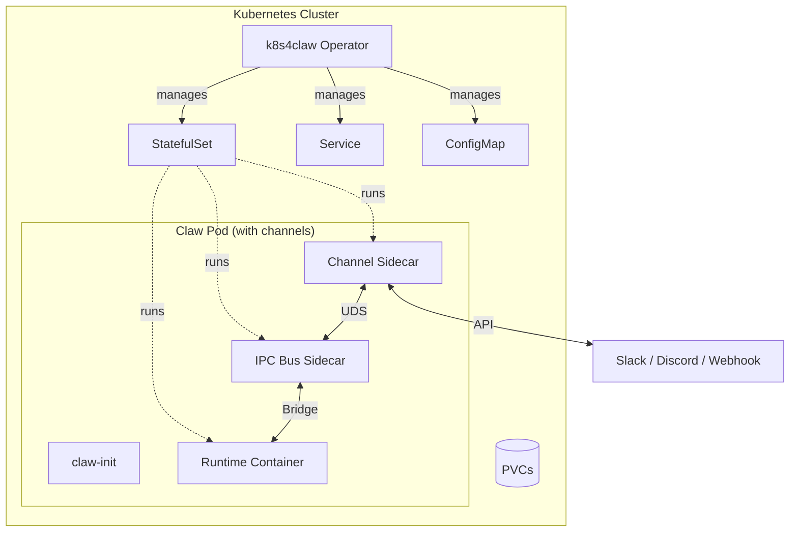

Every AI agent framework has its own deployment story. Claude-based assistants run one way, OpenAI agents another, security-focused runtimes yet another. If you run more than one on Kubernetes, you end up writing the same boilerplate over and over: secret management, persistent storage, graceful updates, inter-service messaging, observability.

**k8s4claw** is an open-source Kubernetes operator that wraps all of this behind a single CRD. You describe *what* the agent is, it handles *how* it runs.

```yaml
apiVersion: claw.prismer.ai/v1alpha1
kind: Claw
metadata:
  name: research-agent
spec:
  runtime: openclaw
  config:
    model: "claude-sonnet-4"
  credentials:
    secretRef:
      name: llm-api-keys
```

The operator reconciles this into a StatefulSet, headless Service, ConfigMap, ServiceAccount, PodDisruptionBudget, and optionally NetworkPolicy and Ingress. When you add a channel (Slack, Discord, Webhook), it also wires up sidecars and a local message bus.

This post walks through the architecture, shows how to get it running locally, and explains the design decisions behind the IPC bus, the auto-update controller, and the runtime adapter system.

---

## The Problem

We had several agent runtimes in flight at once — different languages, different process models, different resource profiles:

| Runtime | Language | Use Case |
|---------|----------|----------|
| OpenClaw | TypeScript/Node.js | Full-featured AI assistant |
| NanoClaw | TypeScript/Node.js | Lightweight personal assistant |
| ZeroClaw | Rust | High-performance agent |
| PicoClaw | Go | Ultra-minimal serverless |
| IronClaw | Rust + WASM | Security-focused agent |
| HermesClaw | Python | Conversational with tool use |
| K8sOps | Go | Cluster self-healing (claw4k8s) |

Each had its own Helm chart, sidecar layout, and update strategy. Adding a Slack channel meant editing several files. Rotating credentials meant touching every deployment. Rolling back a bad update was a manual process.

We wanted one control plane for all of them.

---

## Architecture



The operator watches `Claw` custom resources and reconciles a full stack of Kubernetes objects. A minimal agent (no channels, no persistence) gets just the runtime container plus `claw-init`. If you declare any channels in `spec.channels`, the operator also injects:

1. **claw-init** — an init container that merges default runtime config with any user overrides before the runtime starts.
2. **Runtime container** — the actual AI agent binary.
3. **IPC Bus sidecar** (only when channels are present) — a WAL-backed message router that sits between the runtime and the channel sidecars.
4. **Channel sidecar(s)** — one per referenced `ClawChannel` (Slack, Discord, Webhook today).

There is a second CRD, `ClawChannel`, that describes how to connect to an external system. Channels are defined once and referenced by many Claws.

---

## Quick Start

### Prerequisites

- Kubernetes 1.28+ (or [kind](https://kind.sigs.k8s.io/) for local development)
- Go 1.25+
- `controller-gen` (`go install sigs.k8s.io/controller-tools/cmd/controller-gen@latest`) — needed by `make install`

### Install and run

```bash
git clone https://github.com/Prismer-AI/k8s4claw.git
cd k8s4claw

# Install CRDs into the active cluster
make install

# Run the operator locally against your current kubeconfig.
# --disable-webhooks lets you skip cert-manager setup during local dev.
# In-cluster deployments should leave webhooks enabled.
go run ./cmd/operator/ --disable-webhooks
```

### Create your first agent

```bash
kubectl create secret generic llm-api-keys \
  --from-literal=ANTHROPIC_API_KEY=sk-ant-xxx

cat <<EOF | kubectl apply -f -
apiVersion: claw.prismer.ai/v1alpha1
kind: Claw
metadata:
  name: my-agent
spec:
  runtime: openclaw
  config:
    model: "claude-sonnet-4"
  credentials:
    secretRef:
      name: llm-api-keys
  persistence:
    session:
      enabled: true
      size: 2Gi
      mountPath: /data/session
    workspace:
      enabled: true
      size: 10Gi
      mountPath: /workspace
EOF

kubectl get claw my-agent -w
```

### Connect Slack

```yaml
apiVersion: claw.prismer.ai/v1alpha1
kind: ClawChannel
metadata:
  name: team-slack
spec:
  type: slack
  mode: bidirectional
  credentials:
    secretRef:
      name: slack-bot-token
  config:
    appId: "A0123456789"
```

Reference it from your `Claw`:

```yaml
spec:
  channels:
    - name: team-slack
      mode: bidirectional
```

On the next reconcile the operator injects a Slack sidecar, spins up the IPC bus sidecar, and wires them together. The runtime container does not need to know anything about Slack — it just talks to the bus.

---

## Deep Dive: The IPC Bus

The IPC bus is the most interesting piece of k8s4claw. It is a Kubernetes [native sidecar](https://kubernetes.io/blog/2023/08/25/native-sidecar-containers/) (an init container with `restartPolicy: Always`) that routes JSON messages between channel sidecars and the agent runtime.

```
Channel Sidecar ──UDS──► IPC Bus ──Bridge──► Runtime Container
                         │ WAL  │
                         │ DLQ  │
                         │ Ring │
                         └──────┘
```

### Why not just HTTP?

We tried. The problem is reliability. When a Slack event arrives while the runtime is overloaded, you need somewhere to buffer it. If the runtime crashes mid-response, you need to redeliver. When a channel sidecar falls behind, you need backpressure instead of dropped messages.

Three mechanisms do the work:

**1. Write-Ahead Log (WAL)** — Every inbound message is appended to a WAL on `emptyDir` before delivery. On restart, unacknowledged messages are replayed. Periodic compaction keeps the file bounded.

**2. Dead Letter Queue (DLQ)** — Messages that exceed the retry limit land in a BoltDB-backed DLQ instead of being dropped silently. You can inspect them later.

**3. Ring buffer with backpressure** — A fixed-size circular buffer with configurable high/low watermarks. Crossing the high watermark sends `slow_down` upstream; draining to the low watermark sends `resume`.

### Bridge protocols

Different runtimes speak different wire protocols. The bus abstracts this behind a `RuntimeBridge` interface:

| Runtime | Bridge | Protocol |
|---------|--------|----------|
| OpenClaw | WebSocket | Full-duplex JSON over WS |
| NanoClaw | UDS | Length-prefix framed |
| ZeroClaw | SSE | HTTP POST + Server-Sent Events |
| PicoClaw | TCP | Length-prefix framed |

Here is the actual interface ([`internal/ipcbus/bridge.go`](https://github.com/Prismer-AI/k8s4claw/blob/main/internal/ipcbus/bridge.go)):

```go
type RuntimeBridge interface {
    Connect(ctx context.Context) error
    Send(ctx context.Context, msg *Message) error
    Receive(ctx context.Context) (<-chan *Message, error)
    Close() error
}
```

Adding a new transport means implementing these four methods.

---

## Deep Dive: Auto-Update Controller

The auto-update controller polls OCI registries on a cron schedule, filters new tags by a semver constraint, and performs health-verified rollouts with automatic rollback.

```yaml
spec:
  autoUpdate:
    enabled: true
    versionConstraint: "^1.x"
    schedule: "0 3 * * *"
    healthTimeout: "10m"
    maxRollbacks: 3
```

### How it works

1. **Poll** — on each cron tick, list tags from the registry and filter by the semver constraint.
2. **Initiate** — annotate the `Claw` with the target image and transition into the `HealthCheck` phase.
3. **Health check** — watch the StatefulSet readiness until all replicas are ready or the timeout fires.
4. **Success** — update status, clear the annotation, schedule the next cron tick.
5. **Timeout** — roll back to the previous image.
6. **Circuit breaker** — after N consecutive rollbacks, stop trying and emit an event plus a Prometheus metric.

The state machine lives in annotations and status conditions, so it survives operator restarts:

```go
phase := claw.Annotations["claw.prismer.ai/update-phase"]
if phase == "HealthCheck" {
    return r.reconcileHealthCheck(ctx, &claw)
}
```

### Version history

Every attempt is recorded:

```yaml
status:
  autoUpdate:
    currentVersion: "1.2.0"
    versionHistory:
      - version: "1.2.0"
        appliedAt: "2026-03-28T03:00:00Z"
        status: Healthy
      - version: "1.1.5"
        appliedAt: "2026-03-21T03:00:00Z"
        status: RolledBack
    failedVersions: ["1.1.5"]
    circuitOpen: false
```

---

## The Runtime Adapter Pattern

Each runtime is a Go struct implementing `RuntimeAdapter`:

```go
type RuntimeAdapter interface {
    // Pod shape
    PodTemplate(claw *v1alpha1.Claw) *corev1.PodTemplateSpec
    HealthProbe(claw *v1alpha1.Claw) *corev1.Probe
    ReadinessProbe(claw *v1alpha1.Claw) *corev1.Probe
    DefaultConfig() *RuntimeConfig
    GracefulShutdownSeconds() int32

    // Spec validation
    Validate(ctx context.Context, spec *v1alpha1.ClawSpec) field.ErrorList
    ValidateUpdate(ctx context.Context, oldSpec, newSpec *v1alpha1.ClawSpec) field.ErrorList
}
```

A new adapter typically lives in a single file of ~100 lines. The shared `BuildPodTemplate` helper handles init containers, volume mounts, security context, and environment variables, so the adapter only declares what is actually different:

```go
type MyRuntimeAdapter struct{}

func (a *MyRuntimeAdapter) PodTemplate(claw *v1alpha1.Claw) *corev1.PodTemplateSpec {
    return BuildPodTemplate(claw, &RuntimeSpec{
        Image:     "my-registry/my-runtime:latest",
        Ports:     []corev1.ContainerPort{{Name: "gateway", ContainerPort: 8080}},
        Resources: resources("100m", "256Mi", "500m", "512Mi"),
        // ...
    })
}
// plus HealthProbe, ReadinessProbe, DefaultConfig, GracefulShutdownSeconds,
// Validate, ValidateUpdate
```

Validation is per-runtime on purpose. OpenClaw and IronClaw require credentials because they call LLM APIs. ZeroClaw and PicoClaw permit credential-less operation. HermesClaw rejects `spec.channels` because it brings its own gateway. NanoClaw currently has no update-time persistence checks. The point is each adapter owns its own rules.

---

## Go SDK

For programmatic access there is a Go SDK ([`sdk/`](https://github.com/Prismer-AI/k8s4claw/tree/main/sdk)):

```go
import (
    "context"

    "github.com/Prismer-AI/k8s4claw/sdk"
)

client, err := sdk.NewClient() // uses the ambient kubeconfig by default
if err != nil {
    return err
}

claw, err := client.Create(ctx, &sdk.ClawSpec{
    Runtime: sdk.OpenClaw,
    Config: &sdk.RuntimeConfig{
        Environment: map[string]string{"MODEL": "claude-sonnet-4"},
    },
})
if err != nil {
    return err
}

// Block until the Claw reaches phase "Running" or ctx expires.
if err := client.WaitForReady(ctx, claw); err != nil {
    return err
}
```

There is also a channel SDK for writing custom sidecars:

```go
import (
    "context"
    "encoding/json"

    "github.com/Prismer-AI/k8s4claw/sdk/channel"
)

client, err := channel.Connect(ctx,
    channel.WithChannelName("my-channel"), // or set CHANNEL_NAME env
    channel.WithSocketPath("/var/run/claw/bus.sock"),
    channel.WithBufferSize(100),
)
if err != nil {
    return err
}
defer client.Close()

// Send a message to the runtime.
if err := client.Send(ctx, json.RawMessage(`{"text":"Hello"}`)); err != nil {
    return err
}

// Receive returns a channel of *InboundMessage.
inbox, err := client.Receive(ctx)
if err != nil {
    return err
}
for msg := range inbox {
    // handle msg
    _ = msg
}
```

---

## Testing Strategy

The repo has reasonable test coverage on the core packages. A recent local run looked roughly like this:

| Package | Coverage (approx.) |
|---------|-------------------|
| `internal/webhook` | ~97% |
| `internal/runtime` | ~94% |
| `internal/registry` | ~86% |
| `sdk` | ~83% |
| `internal/controller` | ~81% |
| `sdk/channel` | ~81% |
| `internal/ipcbus` | ~80% |

Numbers move PR by PR. CI publishes a coverage report as an artifact and gates on a total-coverage threshold; there is no per-package floor enforced today. Treat the table as a snapshot, not a contract.

The testing pyramid:

- **Unit tests** — pure functions, table-driven, `t.Parallel()` everywhere.
- **Fake-client tests** — `fake.NewClientBuilder()` for controller logic without a real cluster.
- **envtest integration tests** — real etcd + API server for webhook validation and reconcile loops.

The auto-update controller uses dependency injection via `Clock` and `TagLister` interfaces so time-dependent and registry-dependent code is fully testable with no network calls.

---

## What's Not Done Yet

Worth being honest about:

- **`custom` runtime type** is present in the CRD enum but no adapter is registered. If you want a runtime that is not in the built-in list today, you fork and add an adapter.
- **HermesClaw** does not yet integrate with the k8s4claw channel sidecars — it uses its own gateway.
- **Local operator runs** need `--disable-webhooks` unless you've set up cert-manager or your own TLS. In-cluster deployments via the Helm chart handle this for you.
- **CRD surface is larger than just `Claw`** — `ClawChannel`, `ClawSelfConfig`, and related types are part of the contract. "Single CRD" is a simplification; "small, focused set of CRDs" is closer to the truth.

---

## What's Next

k8s4claw is open source under Apache-2.0. The current open contribution target is [Issue #4: add snapshot and PDB envtest coverage](https://github.com/Prismer-AI/k8s4claw/issues/4). If you want to propose something else, open a new issue and we'll triage it.

**GitHub**: [github.com/Prismer-AI/k8s4claw](https://github.com/Prismer-AI/k8s4claw)

If you run AI agents on Kubernetes and you're tired of maintaining the plumbing around them, give it a try. Star the repo if it helps, and open an issue if something is off — both signals are useful.
