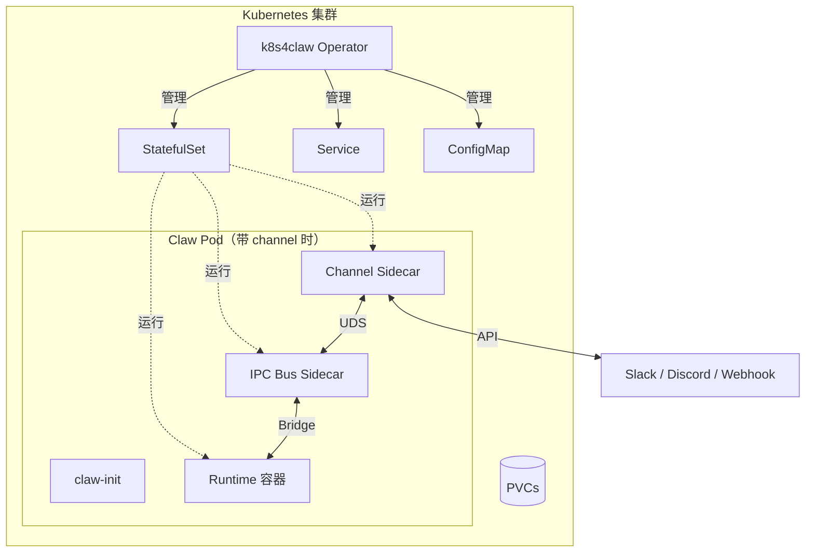

# k8s4claw：用一个 CRD 管理 Kubernetes 上的 AI Agent 运行时

> 开源 K8s Operator：统一管理异构 AI Agent 运行时，内置 IPC 总线（WAL/DLQ）、自动更新熔断回滚、Go SDK。

## 为什么要做这个

每个 AI Agent 框架都有自己的部署方案。Claude 一套、OpenAI 一套、安全强化型运行时又是另一套。在 K8s 上同时跑多个，就会发现自己反复在写同样的基础设施：Secret 管理、持久化存储、优雅更新、进程间消息、可观测性。

**k8s4claw** 把这些全部封装到一个 Kubernetes Operator 里。你只描述 agent **是什么**，Operator 负责 **怎么跑**。

```yaml
apiVersion: claw.prismer.ai/v1alpha1
kind: Claw
metadata:
  name: research-agent
spec:
  runtime: openclaw
  config:
    model: "claude-sonnet-4"
  credentials:
    secretRef:
      name: llm-api-keys
```

Operator 会把它调谐为一整套 K8s 对象：StatefulSet、Headless Service、ConfigMap、ServiceAccount、PDB，按需的 NetworkPolicy 和 Ingress。当你加上 channel（Slack / Discord / Webhook），它还会自动注入 sidecar 和本地消息总线。

## 团队遇到的问题

手上同时有几个 agent 运行时——语言、进程模型、资源配置都不一样：

| 运行时 | 语言 | 定位 |
|--------|------|------|
| OpenClaw | TypeScript/Node.js | 全功能 AI 助手 |
| NanoClaw | TypeScript/Node.js | 轻量个人助手 |
| ZeroClaw | Rust | 高性能 agent |
| PicoClaw | Go | 极简 serverless |
| IronClaw | Rust + WASM | 隐私/安全优先 |
| HermesClaw | Python | 对话 + 工具调用 |
| K8sOps | Go | 集群自愈（claw4k8s） |

每个都有独立的 Helm chart、sidecar 布局、更新流程。加一个 Slack 通道要改好几个文件。轮换密钥要逐个部署改。回滚一次失败的发布得人工来。

于是想做一个统一的控制面。

## 架构



Operator 监听 `Claw` CR，按需调谐完整的 K8s 对象栈。最小场景（没有 channel、没有持久化）只有 runtime 容器 + `claw-init`。只要在 `spec.channels` 里声明了 channel，Operator 就会注入：

1. **claw-init**：init 容器，启动前合并默认配置和用户覆盖。
2. **Runtime 容器**：真正的 agent 二进制。
3. **IPC Bus sidecar**（仅当有 channel 时）：基于 WAL 的消息路由器，夹在 runtime 和 channel 之间。
4. **Channel sidecar**：每个 `ClawChannel` 对应一个（目前支持 Slack / Discord / Webhook）。

还有第二个 CRD `ClawChannel`——描述如何连接到外部系统。Channel 定义一次，可以被多个 Claw 引用。

## 快速开始

### 前置依赖

- Kubernetes 1.28+（本地开发可以用 [kind](https://kind.sigs.k8s.io/)）
- Go 1.25+
- `controller-gen`：`go install sigs.k8s.io/controller-tools/cmd/controller-gen@latest`（`make install` 会用到）

### 安装并运行

```bash
git clone https://github.com/Prismer-AI/k8s4claw.git
cd k8s4claw

# 把 CRD 装到当前集群
make install

# 用当前 kubeconfig 在本地跑 operator
# 本地开发时用 --disable-webhooks 跳过 cert-manager 设置
# 集群部署时应保留 webhook
go run ./cmd/operator/ --disable-webhooks
```

### 部署第一个 agent

```bash
kubectl create secret generic llm-api-keys \
  --from-literal=ANTHROPIC_API_KEY=sk-ant-xxx

cat <<EOF | kubectl apply -f -
apiVersion: claw.prismer.ai/v1alpha1
kind: Claw
metadata:
  name: my-agent
spec:
  runtime: openclaw
  config:
    model: "claude-sonnet-4"
  credentials:
    secretRef:
      name: llm-api-keys
  persistence:
    session:
      enabled: true
      size: 2Gi
      mountPath: /data/session
    workspace:
      enabled: true
      size: 10Gi
      mountPath: /workspace
EOF

kubectl get claw my-agent -w
```

### 接入 Slack

```yaml
apiVersion: claw.prismer.ai/v1alpha1
kind: ClawChannel
metadata:
  name: team-slack
spec:
  type: slack
  mode: bidirectional
  credentials:
    secretRef:
      name: slack-bot-token
  config:
    appId: "A0123456789"
```

在 `Claw` 里引用：

```yaml
spec:
  channels:
    - name: team-slack
      mode: bidirectional
```

下次调谐时，Operator 自动注入 Slack sidecar，拉起 IPC Bus sidecar，把两者串起来。Runtime 容器完全不需要知道 Slack 的存在——它只跟 bus 说话。

## 深入看看：IPC 总线

IPC Bus 是 k8s4claw 最有意思的部分。它是一个 [K8s native sidecar](https://kubernetes.io/blog/2023/08/25/native-sidecar-containers/)（`restartPolicy: Always` 的 init 容器），在 channel sidecar 和 agent runtime 之间路由 JSON 消息。

```text
Channel Sidecar ──UDS──► IPC Bus ──Bridge──► Runtime Container
                         │ WAL  │
                         │ DLQ  │
                         │ Ring │
                         └──────┘
```

### 为什么不直接用 HTTP

试过，问题是可靠性。Slack 事件进来但 runtime 过载时需要缓冲；runtime 中途挂掉需要重投；channel sidecar 跟不上需要背压而不是丢消息。

三种机制：

**1. WAL 写前日志**：每条入站消息先追加写到 emptyDir 的 WAL，再投递。重启后未确认的消息会重放。定期 compaction 保证文件不膨胀。

**2. DLQ 死信队列**：超过重试上限的消息落到 BoltDB 支撑的 DLQ，不静默丢弃。之后可以检查。

**3. 环形缓冲 + 背压**：固定大小，可配置高/低水位。越过高水位向上游发 `slow_down`；回落到低水位发 `resume`。

### Bridge 协议

不同 runtime 说不同的协议。Bus 通过 `RuntimeBridge` 接口抽象：

| Runtime | Bridge | 协议 |
|---------|--------|------|
| OpenClaw | WebSocket | WS 上的全双工 JSON |
| NanoClaw | UDS | 长度前缀帧 |
| ZeroClaw | SSE | HTTP POST + Server-Sent Events |
| PicoClaw | TCP | 长度前缀帧 |

真实接口在 [`internal/ipcbus/bridge.go`](https://github.com/Prismer-AI/k8s4claw/blob/main/internal/ipcbus/bridge.go)：

```go
type RuntimeBridge interface {
    Connect(ctx context.Context) error
    Send(ctx context.Context, msg *Message) error
    Receive(ctx context.Context) (<-chan *Message, error)
    Close() error
}
```

加一种新传输协议，实现这四个方法即可。

## 深入看看：自动更新控制器

按 cron 周期轮询 OCI registry，用 semver 约束过滤新 tag，执行健康验证的滚动升级，失败自动回滚。

```yaml
spec:
  autoUpdate:
    enabled: true
    versionConstraint: "^1.x"
    schedule: "0 3 * * *"
    healthTimeout: "10m"
    maxRollbacks: 3
```

### 工作流程

1. **轮询**：cron 触发后列出 registry 的 tag，按 semver 过滤。
2. **发起**：给 `Claw` 打目标镜像的 annotation，进入 `HealthCheck` 阶段。
3. **健康检查**：watch StatefulSet 的 ready 状态直到全部就绪或超时。
4. **成功**：更新 status，清理 annotation，按下一个 cron 重新入队。
5. **超时**：回滚到上一个镜像。
6. **熔断**：连续 N 次回滚后停止尝试，发 Event + Prometheus 指标。

状态机活在 annotation 和 status condition 里，所以 operator 重启后可以接着跑：

```go
phase := claw.Annotations["claw.prismer.ai/update-phase"]
if phase == "HealthCheck" {
    return r.reconcileHealthCheck(ctx, &claw)
}
```

### 版本历史

每次尝试都会记录：

```yaml
status:
  autoUpdate:
    currentVersion: "1.2.0"
    versionHistory:
      - version: "1.2.0"
        appliedAt: "2026-03-28T03:00:00Z"
        status: Healthy
      - version: "1.1.5"
        appliedAt: "2026-03-21T03:00:00Z"
        status: RolledBack
    failedVersions: ["1.1.5"]
    circuitOpen: false
```

## Runtime Adapter 模式

每个 runtime 是一个实现 `RuntimeAdapter` 的 Go 结构体：

```go
type RuntimeAdapter interface {
    // Pod 形状
    PodTemplate(claw *v1alpha1.Claw) *corev1.PodTemplateSpec
    HealthProbe(claw *v1alpha1.Claw) *corev1.Probe
    ReadinessProbe(claw *v1alpha1.Claw) *corev1.Probe
    DefaultConfig() *RuntimeConfig
    GracefulShutdownSeconds() int32

    // Spec 校验
    Validate(ctx context.Context, spec *v1alpha1.ClawSpec) field.ErrorList
    ValidateUpdate(ctx context.Context, oldSpec, newSpec *v1alpha1.ClawSpec) field.ErrorList
}
```

一个新的 adapter 通常一个文件约 100 行。共享的 `BuildPodTemplate` 处理 init 容器、volume 挂载、安全上下文、环境变量；adapter 只声明差异化部分：

```go
type MyRuntimeAdapter struct{}

func (a *MyRuntimeAdapter) PodTemplate(claw *v1alpha1.Claw) *corev1.PodTemplateSpec {
    return BuildPodTemplate(claw, &RuntimeSpec{
        Image:     "my-registry/my-runtime:latest",
        Ports:     []corev1.ContainerPort{{Name: "gateway", ContainerPort: 8080}},
        Resources: resources("100m", "256Mi", "500m", "512Mi"),
        // ...
    })
}
// 还要实现 HealthProbe、ReadinessProbe、DefaultConfig、GracefulShutdownSeconds、
// Validate、ValidateUpdate
```

校验按 runtime 区分是有意的：OpenClaw、IronClaw 必须有凭证（要调 LLM API）；ZeroClaw、PicoClaw 允许没有凭证；HermesClaw 禁止 `spec.channels`（它带自己的 gateway）；NanoClaw 目前没有更新时的持久化校验。每个 adapter 管自己的规则。

## Go SDK

程序化访问用 Go SDK（[`sdk/`](https://github.com/Prismer-AI/k8s4claw/tree/main/sdk)）：

```go
import (
    "context"

    "github.com/Prismer-AI/k8s4claw/sdk"
)

client, err := sdk.NewClient() // 默认用当前 kubeconfig
if err != nil {
    return err
}

claw, err := client.Create(ctx, &sdk.ClawSpec{
    Runtime: sdk.OpenClaw,
    Config: &sdk.RuntimeConfig{
        Environment: map[string]string{"MODEL": "claude-sonnet-4"},
    },
})
if err != nil {
    return err
}

// 阻塞直到 Claw 进入 Running 阶段或 ctx 超时
if err := client.WaitForReady(ctx, claw); err != nil {
    return err
}
```

还有 Channel SDK，用来写自定义 sidecar：

```go
import (
    "context"
    "encoding/json"

    "github.com/Prismer-AI/k8s4claw/sdk/channel"
)

client, err := channel.Connect(ctx,
    channel.WithChannelName("my-channel"), // 或设置 CHANNEL_NAME 环境变量
    channel.WithSocketPath("/var/run/claw/bus.sock"),
    channel.WithBufferSize(100),
)
if err != nil {
    return err
}
defer client.Close()

// 向 runtime 发消息
if err := client.Send(ctx, json.RawMessage(`{"text":"Hello"}`)); err != nil {
    return err
}

// Receive 返回一个 *InboundMessage 的只读 channel
inbox, err := client.Receive(ctx)
if err != nil {
    return err
}
for msg := range inbox {
    _ = msg // 处理消息
}
```

## 测试策略

核心包有一定的测试覆盖度。最近一次本地跑大概是：

| 包 | 覆盖率（约） |
|---|------|
| `internal/webhook` | ~97% |
| `internal/runtime` | ~94% |
| `internal/registry` | ~86% |
| `sdk` | ~83% |
| `internal/controller` | ~81% |
| `sdk/channel` | ~81% |
| `internal/ipcbus` | ~80% |

数字会随 PR 波动。CI 把覆盖率报告作为 artifact 发布，总覆盖率有门槛，单包目前没强制下限。这个表当作一个快照看，不是承诺。

测试金字塔：

- **单元测试**：纯函数、表驱动、到处用 `t.Parallel()`。
- **Fake client 测试**：`fake.NewClientBuilder()` 测控制器逻辑，不依赖真集群。
- **envtest 集成测试**：真实 etcd + API server，测 webhook 校验和调谐循环。

自动更新控制器通过 `Clock` 和 `TagLister` 接口做依赖注入，让所有时间/网络相关代码都可以无网络完整测试。

## 还没做的

诚实一点列一下：

- **CRD 里的 `custom` runtime**：enum 值存在，但还没注册对应的 adapter。要跑不在内置列表里的 runtime，目前只能 fork 加 adapter。
- **HermesClaw 和 k8s4claw channel sidecar**：还没打通，现在用它自己的 gateway。
- **本地跑 operator**：除非你配好 cert-manager 或自签证书，否则需要 `--disable-webhooks`。通过 Helm chart 部署到集群里则由 chart 处理。
- **CRD 面不止 `Claw`**：还有 `ClawChannel`、`ClawSelfConfig` 等。"一个 CRD" 是种简化说法，更准确的说法是"一组小而聚焦的 CRD"。

## 下一步

k8s4claw 基于 Apache-2.0 开源。想参与的话，从 [Issue #4：补 snapshot 和 PDB 的 envtest 覆盖](https://github.com/Prismer-AI/k8s4claw/issues/4) 开始比较合适。其他可以去 [issue tracker](https://github.com/Prismer-AI/k8s4claw/issues) 翻翻。

**GitHub**：[github.com/Prismer-AI/k8s4claw](https://github.com/Prismer-AI/k8s4claw)

如果你在 K8s 上跑 AI agent 又嫌维护周边基础设施烦，欢迎试一下。用得顺手就给个 star，用得不爽就开 issue——两种反馈都有价值。
