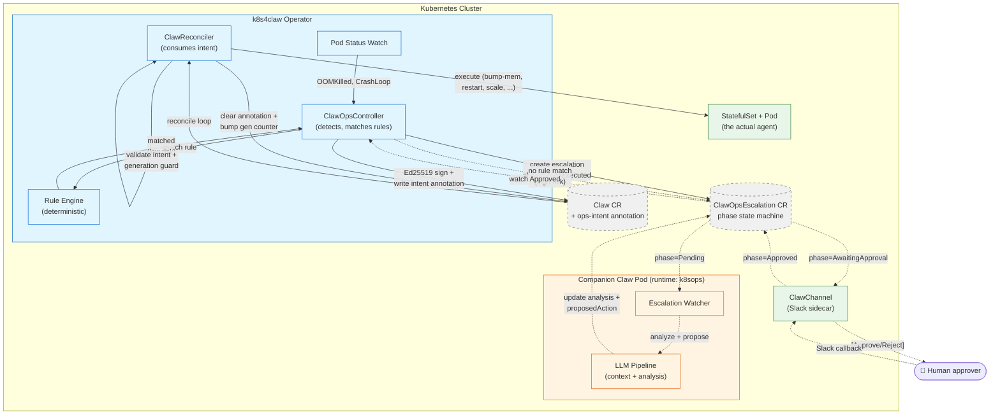
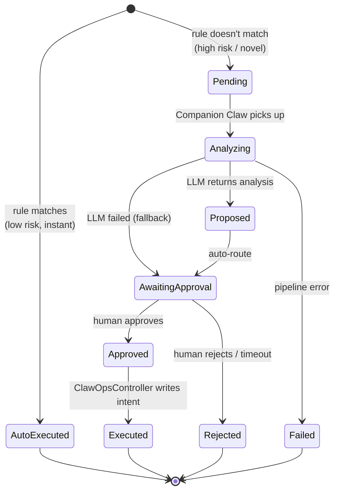

# claw4k8s Architecture

A single diagram explaining what makes claw4k8s architecturally different:
**agents never patch StatefulSets directly** — everything flows through a single
intent annotation consumed by one reconciler.

## The full loop (auto-remediation path)



**Solid arrows** = auto-remediation path (low-risk, rule-matched, seconds to fix).

**Dashed arrows** = LLM escalation path (novel/high-risk, minutes including human approval).

## Why intent annotation, not direct patching?

```mermaid
flowchart LR
    subgraph bad["❌ Other tools: direct patching"]
        direction TB
        A1["LLM / rule"] -->|patch| B1["StatefulSet"]
        A2["Another controller"] -->|patch| B1
        A3["Yet another"] -->|patch| B1
        B1 -.contention.-> X1["💥 race conditions<br/>no single audit point<br/>prompt injection escapes"]
    end

    subgraph good["✅ claw4k8s: intent annotation"]
        direction TB
        C1["LLM / rule"] -->|write intent| D1["Claw CR<br/>annotation"]
        C2["Human approver"] -->|write intent<br/>(via ClawOpsController)| D1
        D1 -->|validate<br/>allowlist +<br/>generation guard| D2["ClawReconciler<br/>(single writer)"]
        D2 -->|patch| E1["StatefulSet"]
        D2 -->|Ed25519 sign +<br/>K8s Event| E2["Audit trail"]
    end

    classDef bad fill:#ffebee,stroke:#c62828
    classDef good fill:#e8f5e9,stroke:#2e7d32
    class bad,A1,A2,A3,B1,X1 bad
    class good,C1,C2,D1,D2,E1,E2 good
```

**Four properties this gives us for free:**

1. **Zero controller contention** — only `ClawReconciler` writes to sub-resources
2. **Prompt-injection defense** — LLM output is JSON inside an annotation; the reconciler validates against a 5-action allowlist before touching anything
3. **Generation guard** — each intent has a monotonic generation; duplicates are dropped
4. **Single audit chokepoint** — every change flows through one place, Ed25519-signed, K8s-event-emitting

## State machine (ClawOpsEscalation CR)



- **AutoExecuted** (terminal, fast path): rule engine matched, action signed and executed within seconds. No human involvement.
- **Executed** (terminal, slow path): LLM proposed, human approved, then ClawOpsController wrote the intent.
- **Rejected / Failed** (terminal): never executed, preserved for audit.

TTL-based GC cleans terminal CRs after `ttlSecondsAfterFinished` (default 7 days).

## Data flow summary

| Layer | What | Why it matters |
|-------|------|----------------|
| **Sensors** | Pod status watch (primary) + Prometheus (optional) | Pod status is authoritative + real-time; metrics give trends |
| **Rule engine** | Deterministic Go code, 5 default rules | Zero external dependency, inspectable, covered by unit tests |
| **Escalation CR** | Dual purpose: audit trail + workflow state machine | Durable record; K8s-native; survives operator restart |
| **LLM pipeline** | 3 retries with exponential backoff, fallback to human | System degrades to notification mode when LLM is down |
| **Signet layer** | Ed25519 per-action signing (CLI or pure Go) | Tamper-evident audit; falls back gracefully if `signet` binary absent |
| **Intent consumer** | 5 whitelisted actions, generation guard | Bounds blast radius; idempotent |

## Related docs

- [Full design spec](../plans/2026-04-19-claw4k8s-design.md) (Chinese + English, with complete data flow diagrams)
- [Implementation plan](../plans/2026-04-19-claw4k8s-impl.md) (task-by-task with tests)
- [Comparison with k8sgpt / kubectl-ai / Holmes](comparison.md)
